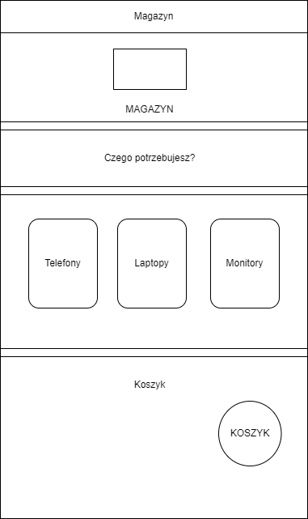
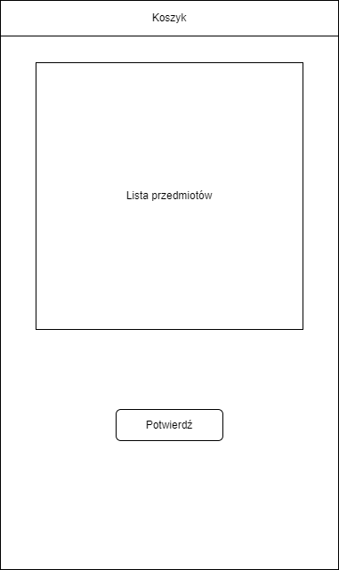
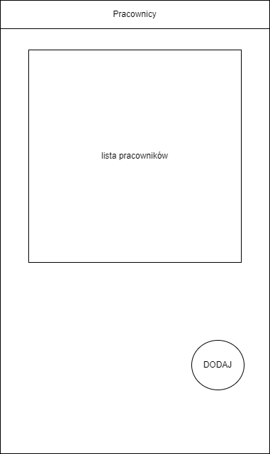
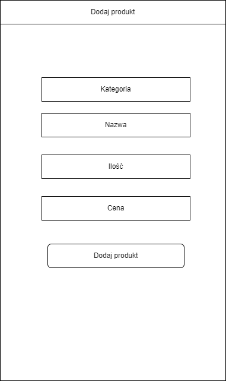

# ReactNative - NativeBase - Expo App

# Prototypy ekranów


#


#



#



#



#


#


#



## Usage

```sh
expo install - to install modules
```

```sh
expo start - to start app
```

```sh
expo start --clear  - to start app and clear cache
```
