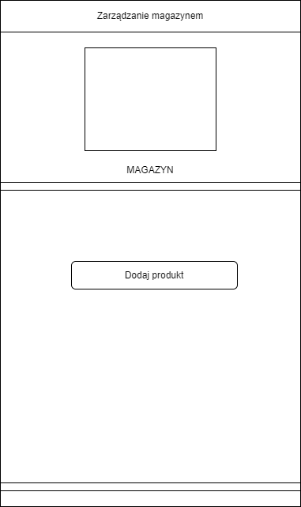

# ReactNative - NativeBase - Expo App

# To do

- Stakowanie tych samych elementów w koszyku
- Ilość itemów w koszyku na głównej stronie magazynu

# Przypadki użycia


#


# Prototypy ekranów


#


#


#


#


#


#



#


## Usage

```sh
expo install - to install modules
```

```sh
expo start - to start app
```

```sh
expo start --clear  - to start app and clear cache
```
